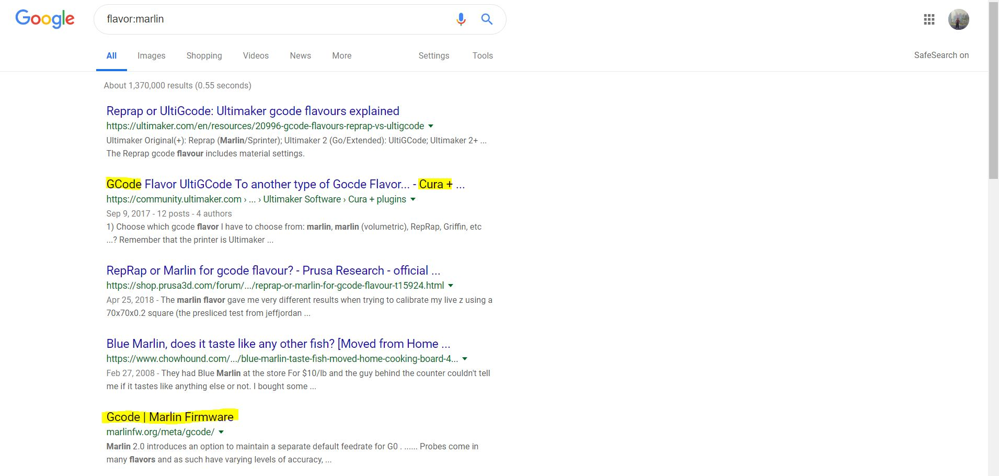
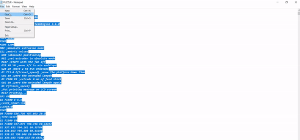
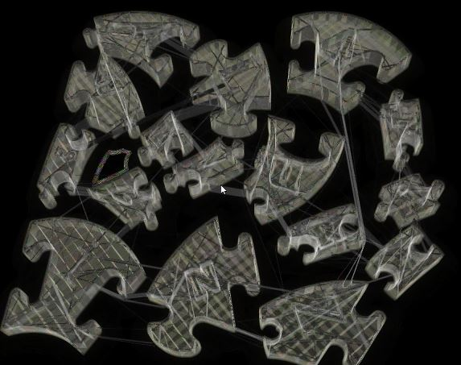

# *PUZZLER* 

- Category - Miscellaneous
- Points -  150
- Difficulty - Medium
- Hint - Happy (Late) Valentines Day 
- Experience Required - NONE :)

# *STEP 1 -  ANALYSIS*
The first step is simple, analyze. You can view the source code in a text editor such as `notepad` or `SUBLIMETEXT`.
```
;FLAVOR:Marlin
;TIME:47006
;Filament used: 29.1298m
;Layer height: 0.1
;Generated with Cura_SteamEngine 3.6.0
M140 S60
M105
M190 S60
M104 S200
M105
M109 S200
M82 ;absolute extrusion mode
G21 ;metric values
 G90 ;absolute positioning
 M82 ;set extruder to absolute mode
 M107 ;start with the fan off
 G28 X0 Y0 ;move X/Y to min endstops
 G28 Z0 ;move Z to min endstops
 G1 Z15.0 F{travel_speed} ;move the platform down 15mm
 G92 E0 ;zero the extruded length
 G1 F200 E6 ;extrude 6 mm of feed stock
 G92 E0 ;zero the extruded length again
 G1 F{travel_speed} 
 ;Put printing message on LCD screen
 M117 Printing...
G92 E0
G1 F1500 E-6.5
;LAYER_COUNT:139
;LAYER:0
M107
G0 F3600 X36.736 Y87.053 Z0.3
;TYPE:SKIRT
G1 F1500 E0
G1 F1800 X37.075 Y90.736 E0.18452
G1 X37.632 Y94.161 E0.35764
G1 X38.013 Y95.808 E0.44198
G1 X38.92 Y98.946 E0.60494
G1 X39.443 Y100.423 E0.68312
G1 X40.02 Y101.845 E0.75968
G1 X40.227 Y101.817 E0.7701
G1 X41.016 Y101.793 E0.80948
G1 X41.804 Y101.848 E0.84889
G1 X42.582 Y101.983 E0.88828
G1 X43.343 Y102.196 E0.92771
G1 X44.078 Y102.485 E0.96711
G1 X44.78 Y102.846 E1.00649
G1 X45.441 Y103.277 E1.04586
.........
M104 S0 ;extruder heater off 
..........
M82 ;absolute extrusion mode
M104 S0
;End of Gcode
```
Looking at the source code we can see that there are headers that contain info about the files origin. Simply `Copy&Paste` keywords form the header and do a quick google search.



Based on the results, we can see that the file is related to gcode.

Defintion: G-code is a language that humans use to tell a machine how to do something. With 3D printing, g-code contains commands to move parts within the printer. G-code consists of G- and M-commands that have an assigned movement or action. The Ultimaker Github page has a list of these commands and their corresponding movements. You create a g-code by slicing a file in **Cura** and saving it. The saved file will be converted to g-code, the language the printer understands and uses to create a 3D print. We can confirm that the file is gcode and that. 
So we can confirm that the file is gcode by looking at the end of the file and also due to the fact that the source code contains coordinates which pinpoint the areas to 3D-Print. 

# *STEP 2 -  OPERATION*
Now that we now that our file is gcode we can simply convert it by saving it as .gcode.`FILE->SAVE AS->PUZZLR.gcode->SELECT ALL FILES->THEN SAVE`


Now we know that the file is a gcode file, we can use an online gcode viewer to view the actual 3d-build.

 REALLY COOL GCODE VIEWER - http://jherrm.com/gcode-viewer/

  
   As you can see, the gcode is represented as a PUZZLE with letters embedded into the pieces. Now we can move onto the final step, ASSEMBLY.
  # *STEP 3 -  ASSEMBLY*
   The assembly of the pieces cannot occur with just a render of the overall puzzle. We need the individual pieces along with the letters. You could 3-D print the entire puzzle but that isn't ideal considering that this CTF only lasted 1 day. So to overcome this obstacle what you need is an online viewer that can model a 2-D perspective along with a sheet filter that can transition between certain layers of the pieces.
   
   LINK- http://www.gcodeanalyser.com/
   
   At this point we can fire up `MS Powerpoint` and solve the puzzle. To reach this step though, you first need to crop out each individual piece and change the background to transparent so that way when you are merging the pieces, there isn't any overlap in the backgrounds. Fitting the pieces together will form a shape that relates back to our hint.
   
   At this point, the message can be read starting from the bottom piece(v) and going all the way around clockwise: ViRgiNiaIZ4LuVrz
   
   THE END


